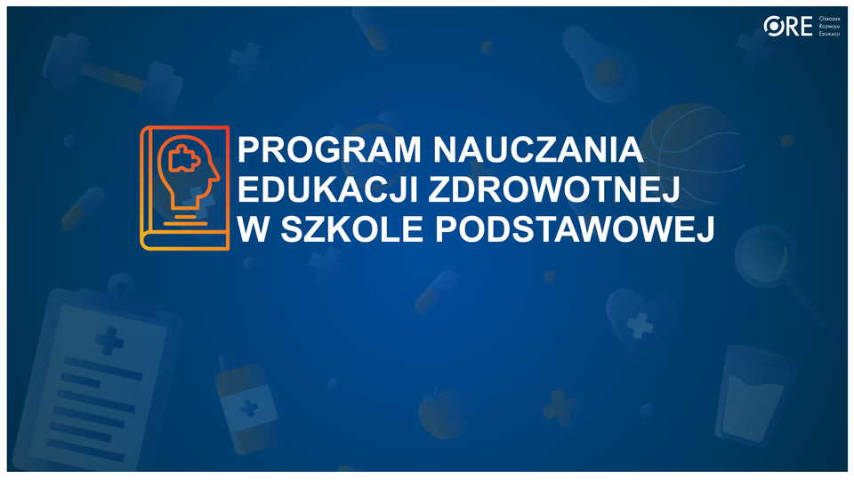

# Edukacja zdrowotna i cyberbezpieczeństwo – projekt wsparcia nauczycieli

## 📌 O projekcie
Ten projekt powstał, aby **wesprzeć nauczycieli szkół podstawowych** w realizacji programu edukacji zdrowotnej, w szczególności w obszarach związanych z **internetem, higieną cyfrową, cyberprzemocą i dezinformacją**.  
Punktem wyjścia są lekcje opisane w oficjalnym programie edukacji zdrowotnej (źródło: [gov.pl – przykładowy program nauczania edukacji zdrowotnej](https://www.gov.pl/web/edukacja/przykladowy-program-nauczania-edukacji-zdrowotnej)).

Pliki źródłowe PDF i DOCX zostały umieszczone w repozytorium w katalogu `/materialy_zrodlowe/`.

## 🎯 Cel projektu
- **Propagowanie wiedzy** o edukacji zdrowotnej w kontekście cyberbezpieczeństwa i higieny cyfrowej.  
- **Tworzenie dodatkowych materiałów** (scenariusze zajęć, fiszki, pytania, ćwiczenia) do konkretnych lekcji wskazanych w programie.  
- **Wsparcie nauczycieli** – aby mieli gotowe i praktyczne narzędzia do pracy z dziećmi.  
- **Zaangażowanie branżowców (infosec, IT, edukacja cyfrowa)** do rozwijania treści w sposób zrozumiały dla uczniów i przydatny dla nauczycieli.  

## ⚖️ Obowiązki prawne  
Zgodnie z tzw. „Ustawą Kamilka” każdy edukator prowadzący zajęcia z dziećmi i młodzieżą musi posiadać **zaświadczenie o niekaralności z Krajowego Rejestru Karnego** ([informacje na gov.pl](https://www.gov.pl/web/krajowy-rejestr-karny/ustawa-kamilka-uzyskiwanie-zaswiadczen-o-niekaralnosci)).

## 📂 Struktura repozytorium
- `/program_glowny.md` – lista wszystkich lekcji z programu SP (klasy 4–8), z oryginalnymi numerami i tytułami.  
  Wskazane są tam tylko te lekcje, które dotykają tematów internetu, higieny cyfrowej, cyberprzemocy i dezinformacji.  
- `/klasaX/lekcjaY/` – katalogi z materiałami do konkretnych lekcji:  
  - `README.md` – [streszczenie, cele, wymagania](README.md),  
  - `pytania.md` – [pytania do dyskusji](pytania.md),  
  - `scenariusz.md` – [przykładowy przebieg lekcji](scenariusz.md),  
  - 'fiszki.md' – krótkie materiały pomocnicze dla uczniów - [Fiszki](fiszki.md)  
- `/materialy_zrodlowe/` – oryginalne pliki PDF/DOCX programu z gov.pl.

## 👩‍💻 Wytyczne dla branżowców
1. **Punkt wyjścia**: każda praca zaczyna się od lekcji wskazanej w `program_glowny.md`.  
2. **Dopisywać tylko w katalogach lekcji** – materiały przypisane są do konkretnej lekcji z numerem i nazwą.  
3. **Forma prosta i praktyczna**: pytania, ćwiczenia, przykłady z życia.  
4. **Unikać technicznego żargonu** – nauczyciel i uczeń muszą łatwo zrozumieć przekaz.  
5. **Każdy commit powinien być czytelny**: np. „dodano fiszki o fake newsach do lekcji 28 – Klasa 4”.  
6. **Materiały sprawdzalne** – linki do źródeł, instytucji (NASK, CERT, SaferInternet.pl, FDDS).  

## 🤝 Jak pracujemy
- Branżowcy rozwijają treści w katalogach `/klasaX/lekcjaY`.  
- Nauczyciele mogą korzystać z gotowych scenariuszy i ćwiczeń wprost na lekcjach.  
- Repo ma być **żywym projektem społecznym**, rozwijanym wspólnie przez ekspertów i edukatorów.  

---

📄 **Uwaga**: Plik `program_glowny.md` zawiera pełną listę lekcji, które dotykają tematów związanych z cyberbezpieczeństwem.  
To **podstawowy punkt odniesienia** dla tworzenia dodatkowych materiałów.
